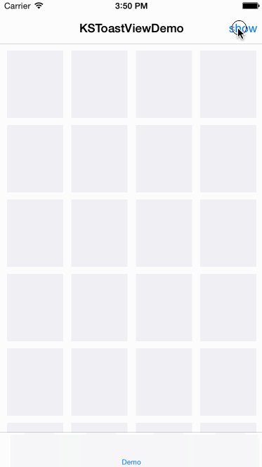

###KSToastView

Simple Popup Notification inspired by [Android Toast Widget](http://developer.android.com/intl/zh-cn/guide/topics/ui/notifiers/toasts.html).



###KSToastView Configure
```
+ (void)ks_setAppearanceBackgroundColor:(UIColor *)backgroundColor;
+ (void)ks_setAppearanceCornerRadius:(CGFloat)cornerRadius;
+ (void)ks_setAppearanceMaxWidth:(CGFloat)maxWidth;
+ (void)ks_setAppearanceMaxLines:(NSInteger)maxLines;
+ (void)ks_setAppearanceOffsetBottom:(CGFloat)offsetBottom;
+ (void)ks_setAppearanceTextAligment:(NSTextAlignment)textAlignment;
+ (void)ks_setAppearanceTextColor:(UIColor *)textColor;
+ (void)ks_setAppearanceTextFont:(UIFont *)textFont;
+ (void)ks_setAppearanceTextInsets:(UIEdgeInsets)textInsets;
+ (void)ks_setToastViewShowDuration:(NSTimeInterval)duration;
```
###KSToastView Show
```
+ (void)ks_showToast:(id)toast;
+ (void)ks_showToast:(id)toast duration:(NSTimeInterval)duration;
+ (void)ks_showToast:(id)toast delay:(NSTimeInterval)delay;
+ (void)ks_showToast:(id)toast completion:(KSToastBlock)completion;
+ (void)ks_showToast:(id)toast duration:(NSTimeInterval)duration delay:(NSTimeInterval)delay;
+ (void)ks_showToast:(id)toast duration:(NSTimeInterval)duration completion:(KSToastBlock)completion;
+ (void)ks_showToast:(id)toast delay:(NSTimeInterval)delay completion:(KSToastBlock)completion;
+ (void)ks_showToast:(id)toast duration:(NSTimeInterval)duration delay:(NSTimeInterval)delay completion:(KSToastBlock)completion;
```

###Usage
```
/// show NSString
[KSToastView ks_showToast:@"Across the Great Wall we can reach every corner in the world."];

/// show NSObject description with 2 seconds.
[KSToastView ks_showToast:self duration:2.0f];

/// show with a completion block.
[KSToastView ks_showToast:@"Start" duration:3.0f completion:^{
    NSLog(@"%@", @"End!");
}];
```

###Installation
Just add KSToastView.h/m files to your Project,

or use [CocoaPods](https://cocoapods.org).
```
pod 'KSToastView', '0.5.7'
```


###License
[The MIT License (MIT)](./LICENSE)
